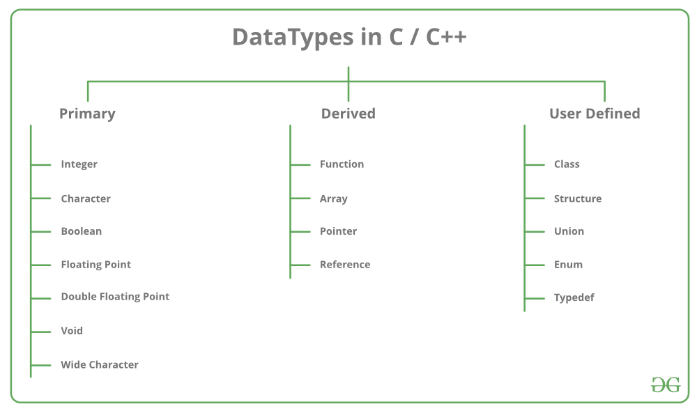
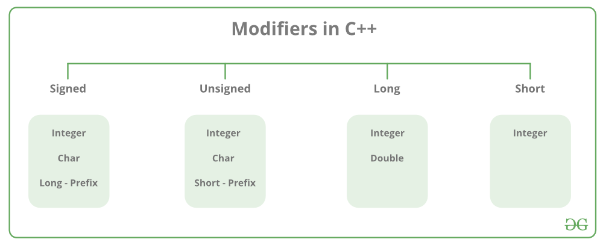

## First C++ Program

GFG link : https://www.geeksforgeeks.org/writing-first-c-program-hello-world-example/

#### Key Takeaways
- Don't use using nampespace std, as it pulls all type definitions into the current scope
  - This can cause conflicts when using multiple namespaces.

## C++ Comments

GFG Link : https://www.geeksforgeeks.org/cpp-comments/

#### Key Takeaways
- During compilation comments are not passed to the parser. Thus they are ignored.
- Single Line Comments using ``//``
- Multiline Comments using ``/* ... */``


## C++ Tokens

GFG Link : https://www.geeksforgeeks.org/cpp-tokens/


#### Key Takeaways
- Identifiers
  - Used to identify entities including but not limited to classes, structs, variables and functions.
  - alphanumeric + '_'
  - Cannot start with a number
  - Case Sensitive
  - Can be same across namespaces std::variable and abc::variable are okay.
  - Can't be same as a keyword.
- Keywords
  - Reserved words that have fixed meanings.
  - always in small-case, only having alphabetical characters.
- Constants
  - Value of constants are ``constant``
  - Method 1 : ```#define constant_name constant_value```
  - Method 2 : ```const constant_name constant_value```
- Special Symbols
  - Similar to keywords, symbols with fixed meanings.
- Operators
  - Unary/ Binary/ Ternary
  - Unary
    - ++, --
  - Binary
    - Arithmetic
    - Bitwise
    - Logical
    - Comparison
    - Assignment
  - Ternary
    - condition 1 ? if true do this : else do this

## C++ Variables

GFG Link : https://www.geeksforgeeks.org/cpp-variables/

#### Key Takeaways
- Variables are of 2 types Local and Global
- Precedence is given to local variable if there exist 2 variables with the same name one local and another global

```cpp

int global = 2;

int main(){
    int global = 6;
    cout << global;
    return 0;
}

--------------------
output : 6

```

- Accessing global variables in the above case using the scope resolution operator
```cpp

int global = 2;

int main(){
    int global = 6;
    cout << "local global" << global;
    cout << "global global" << ::global;
    return 0;
}

--------------------
Finished in 0 ms
local global6
global global2
```
- Global variables are available throughout the lifetime of the programme. They can be accessed from anywhere in the program.
  

## C++ Storage Classes

GFG Link : https://www.geeksforgeeks.org/storage-classes-in-c-with-examples

#### Key Takeaways

- **auto** storage class is the default storage class in cpp for all variables defined inside a block.
  - Scope : Local
  - Default Value : Garbage
  - Memory Location : RAM
  - Lifetime : Destroyed at end of scope.
- **extern** storage class is used to share variables between code-blocks/files.
  - Scope : Global
  - Default Value : 0
  - Memory Location : RAM
  - Lifetime : End of Programme.
  - Functions are by default extern storage classes. A function defined in any file can be used in any other file provided there is a declaration for that function.
  
  ```cpp

  file 1: main.cpp

  #include<iostream>
  #include "library.h"

  int main(){
    number = 5;
    print();
    add_one();
    print();
  }

  --------------------
  5
  6


  file 2: library.h
  
  extern int number;
  void add_one();
  void print();

  file 3 : library.c

  # include<stdio.h>

  int number = 0;

  void add_one(){
    number++;
  }

  void print(){
    printf("%d",number);
  }

  ```

- **static** storage class allows the variable to preserve its value till the end of the programme. It stores the last used value. It does not get destroyed across function calls.
  - Scope: Local
  - Default Value: 0
  - Memory Location : RAM
  - Lifetime : Till end of programme

```

void fun(){
  static int var = 0;
  var++;
  cout << var;
}

int main(){
  fun();
  fun();

  return 0;
}

-------------
1
2

```
- **static** variables can be used in a class as class variables or as static functions.
  - These static class variables cannot be initialized inside the constructor.
  - They need to be done using the scope resolution operator and the class name.
    - ```class_name::static_variable_name```
  - class objects can also be static. 
  - classes can have static functions which can only access static class member variables. These functions need to be accessed using the class name and scope resolution operator.
    - ```class_name::static_function_name(args)```


- **register** storage class stores the variable value in a CPU register it its available else its stored in memory;
- It has the same functionality as the auto storage class.
  - Scope : Local
  - Default Value: Garbage
  - Memory Location : Register if available
  - Lifetime : End of scope
- **mutable** storage class allows changing variables in spite of a const pointer.
  - It can only be applied to member variables of a class or struct.

```c++

class Test {
  public:
    int var1;
    mutable int var2;

    Test(){
      var1 = 0;
      var2 = 1;
    }
}

int main(){
  const Test t;
  cout << t.var2;
  t.var2 = 5;
  cout << t.var2
  return 0;
}

---------------
1
5

```

## C++ Data Types



### Key Takeaways
- 3 types of data-types
  - primary/built-in
  - derived
  - user defined.
- Each datatype has a range of values it can take and a fixed size in bytes which is found using ``sizeof()``
- The size can be changed by using datatype modifiers as prefix.




- In order to find the min and max values of the data-types we can use macro constants such as ```INT_MIN, INT_MAX, CHAR_MIN, ULONG_MAX``` etc.


## C++ Literals

GFG Link : https://www.geeksforgeeks.org/literals-in-c-cpp-with-examples/?ref=lbp

### Key Takeaways
- Literals are constant values that are stored in variables.
- For different kinds of variables different literals need to be used.
  - Integer Literal: ```1, 2, 3, 4```
  - Floating Point Literal : ```1.0, 0.2, 3.4, 4.36```
  - Character Literal : ```A, a, f, G, ^, &```
  - String Literal : ```"c++"```
  
#### Specifying Integer Literals

- Integer Literals can be specified in different bases.
  - ```0X1F5 or 0x1A5``` represents hexadecimal or base 16
  - No suffix ```145``` is base 10
  - ```0145``` is base 8 or octal
  - ```0b1001 or 0B100``` is base 2 or binary.
-  Integer Literals can be specified for different datatype modifiers.
   -  ```1234l or 1234L``` is long
   -  ```124u or 124U``` is unsigned 
   -  ```126ul or 126UL``` is unsigned long int
   -  ```ll or LL``` represents long long
   -  ```ull or ULL``` is for unsigned long long
-  

## Derived Datatypes in C++

GFG Link : https://www.geeksforgeeks.org/derived-data-types-in-c/?ref=lbp

### Key Takeaways
- There are 5 user derived datatypes. 
  - class
  - struct
  - typedef
  - enum
  - union

- **class** holds variables and functions.
- **struct** holds variables of different datatypes.

```c++
struct structName{
  int var1;
  char var2;
  float var3;
};

int main(){
  structName t;
  t.var1 = 1;
  t.var2 = 'a';
  t.var3 = 0.5;
}
```

- **Union** is a derived datatype where the variables defined inside share the same memory location.

```c++

#include<iostream>

union union_name{
  int var1;
  int var2;
  float var3;
  char var4;
};

int main(){
  union union_name test;
  test.var1 = 97;
  cout << test.var1 << endl;
  cout << test.var2 << endl;
  cout << test.var3 << endl;
  cout << test.var4 << endl;
  
  return 0;
}

------------------------------

97 // var1
97 // var2 is int with same memory
1.35926e-43 // 97 in binary is typecasted to float
a // 97 in binary is typecasted to char


```

- **enum** is used to assign integer values to constants. The integer values can be specified or they start from 0.

```c++
#include<iostream>

enum alphabets{
  A=1,
  B=2,  
  a=27,
  b=28  
}; // custom integer values

enum weekday{
    Mon,
    Tue,
    Wed,
    Thu,
    Fri,
    Sat,
    Sun        
}; // unspecified integer values


int main(){
  enum alphabets character;
  character = A;
  cout << character << endl; 
  character = b;
  cout << character<< endl; 
    
  enum weekday day;
  day = Mon;
  cout << day << endl;    
  return 0;
}

```

- **typedef** allows us to define custom datatypes. It allots a new name for the existing types.
  - we can for example use typedef to define a new string class with our custom functions.


```c++
#include <iostream> 
using namespace std; 

// After this line BYTE can be used 
// in place of unsigned char 
typedef unsigned char BYTE; 
  
int main() 
{ 
    BYTE b1, b2; 
    b1 = 'c'; 
    cout << " " << b1; 
    return 0; 
}


```