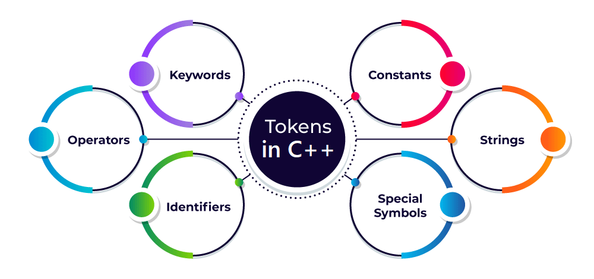

## First C++ Program

GFG link : https://www.geeksforgeeks.org/writing-first-c-program-hello-world-example/

#### Key Takeaways
- Don't use using nampespace std, as it pulls all type definitions into the current scope
  - This can cause conflicts when using multiple namespaces.

## C++ Comments

GFG Link : https://www.geeksforgeeks.org/cpp-comments/

#### Key Takeaways
- During compilation comments are not passed to the parser. Thus they are ignored.
- Single Line Comments using ``//``
- Multiline Comments using ``/* ... */``


## C++ Tokens

GFG Link : https://www.geeksforgeeks.org/cpp-tokens/



#### Key Takeaways
- Identifiers
  - Used to identify entities including but not limited to classes, structs, variables and functions.
  - alphanumeric + '_'
  - Cannot start with a number
  - Case Sensitive
  - Can be same across namespaces std::variable and abc::variable are okay.
  - Can't be same as a keyword.
- Keywords
  - Reserved words that have fixed meanings.
  - always in small-case, only having alphabetical characters.
- Constants
  - Value of constants are ``constant``
  - Method 1 : ```#define constant_name constant_value```
  - Method 2 : ```const constant_name constant_value```
- Special Symbols
  - Similar to keywords, symbols with fixed meanings.
- Operators
  - Unary/ Binary/ Ternary
  - Unary
    - ++, --
  - Binary
    - Arithmetic
    - Bitwise
    - Logical
    - Comparison
    - Assignment
  - Ternary
    - condition 1 ? if true do this : else do this

## C++ Variables

GFG Link : https://www.geeksforgeeks.org/cpp-variables/

#### Key Takeaways
- Variables are of 2 types Local and Global
- Precedence is given to local variable if there exist 2 variables with the same name one local and another global

```cpp

int global = 2;

int main(){
    int global = 6;
    cout << global;
    return 0;
}

--------------------
output : 6

```

- Accessing global variables in the above case using the scope resolution operator
```cpp

int global = 2;

int main(){
    int global = 6;
    cout << "local global" << global;
    cout << "global global" << ::global;
    return 0;
}

--------------------
Finished in 0 ms
local global6
global global2
```
- Global variables are available throughout the lifetime of the programme. They can be accessed from anywhere in the program.
